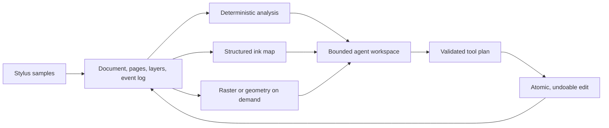

# Neeh SDK technical case study

## Problem

Digital-ink applications commonly give downstream systems a rendered page or a
recognition transcript. Both are useful views, but neither retains the complete
capture: stroke order, direction, pressure, timing, revision history, authorship,
and stable ids. Once that structure is flattened, an agent cannot recover it or
reliably target a specific mark for an edit.

Neeh asks a narrower engineering question: **what substrate and interface let an
application preserve native ink while exposing only the evidence an agent needs
for the current task?**

## Constraints

- The document must remain useful without a model or network connection.
- Model context must stay bounded as a page grows.
- Edits must target stable ids, validate before mutation, and remain undoable.
- Raster perception must remain available for handwriting content that geometry
  cannot identify.
- Protocol claims must be versioned and reproducible from checked-in fixtures.
- Python application code and native C/C++ hosts need a shared substrate.

## System design

The document is the source of truth. Stable-id ink maps, deterministic reducers,
and rendered regions are derived views. The assistant validates a proposed batch
on a cloned document before applying it to the live canvas, so a bad multi-action
plan cannot partially mutate the page.

The implementation spans:

- a Python document/canvas/tool layer for application integration;
- structured agent context, deterministic analyzers, reducers, temporal
  retrieval, and bounded perception actions;
- UIM 3.1 interchange plus event-log-aware session/capture paths;
- a C++17 document/rendering core and versioned C ABI for native hosts; and
- a browser assistant example whose model input and action contract are
  inspectable before execution.

The full rationale and dated decisions are in
[`ARCHITECTURE.md`](../ARCHITECTURE.md) and [`docs/adr/`](adr/README.md).

## Evidence, not a product claim

The repository separates credential-free deterministic evidence from archived
live-model runs. The benchmark index maps every result to its command and raw
output.

| Question | Checked-in result | Reproduce or inspect |
|---|---|---|
| Can pixels preserve stroke history? | 18/18 controlled pairs with opposite order/direction rasterize to byte-identical pixels. | `python benchmarks/move1_render_identical_pairs.py --dry-run` |
| Does the model-facing payload grow with page density? | Analyzer output stays about 275 tokens from 4 to 320 marks while full coordinates grow from 265 to 8,554. | `python benchmarks/move1b_token_budget.py --dry-run` |
| Can a static image or map cover the history task set? | Raster-only scores 0.0 and a static index reaches 0.25; analyzer-first grounds the controlled tasks exactly at zero pixels. | `python benchmarks/move3_grounding.py --dry-run --kinds latest_mark crossed_out grouping recent_change` |
| Does structure change a live model's behavior? | In the archived render-identical run, image-only direction answers are 6/12 while both structured conditions are 12/12. | Read `benchmarks/results/move1_render_identical_gpt55_high.json`. |

See [`benchmarks/README.md`](../benchmarks/README.md) for methodology, model
versions, costs, controls, raw ledgers, and threats to validity.

## What failed and changed the design

The first full live grounding grid did **not** pass the M3 exit gate. Although
structured policies outperformed raster policies on accuracy and target
selection, priced context was not lower than a cheap cropped raster and some
precomputed evidence produced more unsupported claims than an abstaining raster
baseline.

The failures were actionable rather than hidden:

- intent routing sent recent-change questions to a drawing-time analyzer;
- revision evidence ignored exact event-log history in favor of geometric
  candidates;
- recorded groups were not surfaced to any model-facing evidence channel; and
- the model made no on-demand retrieval calls in the measured grid, making
  bootstrap evidence quality the decisive variable.

The routing, event-log, and group-evidence defects have since been fixed and a
focused live re-measurement improved analyzer-first performance on the affected
kinds. A full post-fix grid is still required to restate the exit-gate result.
That remaining work is tracked explicitly in [`ROADMAP.md`](../ROADMAP.md); the
project does not present the gate as passed.

Real-device capture also exposed defects that synthetic pages missed, including
input capability detection on a Samsung tablet and geometry thresholds that
incorrectly scaled with full screen dimensions. Four genuine-device sessions
have been recorded; raw personal capture bundles are not committed by default.
Real undo/redo, genuine scribble cross-outs, multiple writers, and multi-page
coverage remain incomplete.

## Engineering outcome

Neeh currently demonstrates a working, test-backed SDK substrate and a
reproducible research harness:

- applications can preserve, render, query, persist, and edit addressable ink;
- agents can receive compact structured evidence and act through bounded tools;
- deterministic local analysis can answer history questions that pixels cannot;
- native hosts can use the C++ core or ABI without importing the Python
  assistant; and
- benchmark failures feed back into the architecture and public roadmap.

This is pre-alpha engineering evidence, not proof of production adoption or a
claim of external users. The next release gate is the full post-fix grounding
grid, followed by protocol stabilization and integration feedback from another
application.

## Ownership and review trail

Neeh is created and maintained by Kunwarbir Singh Padda. Project authorship is
recorded in [`AUTHORS`](../AUTHORS) and [`CITATION.cff`](../CITATION.cff).
Architecture decisions are preserved as dated ADRs, while tests, raw benchmark
outputs, and Git history provide the review trail for implementation claims.
